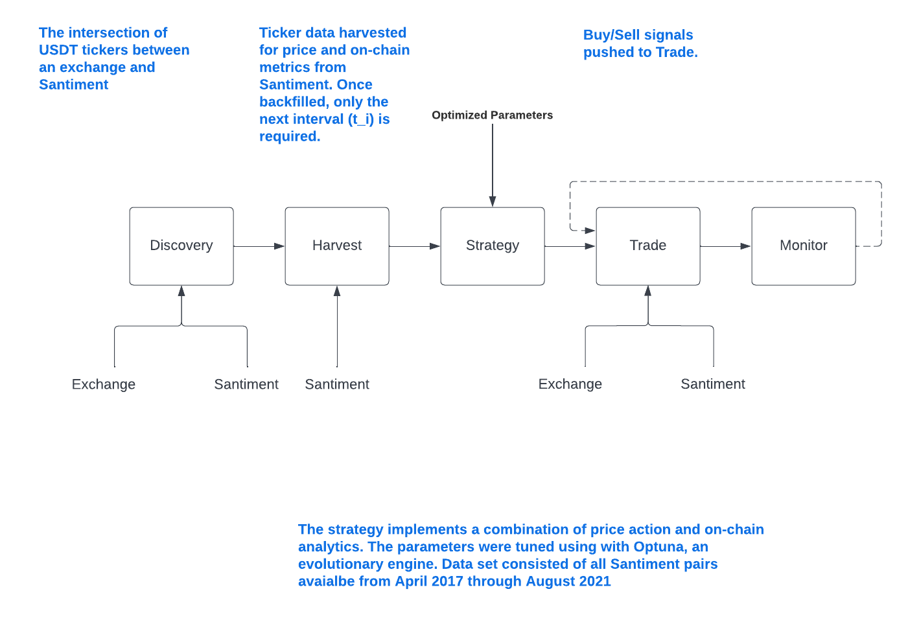
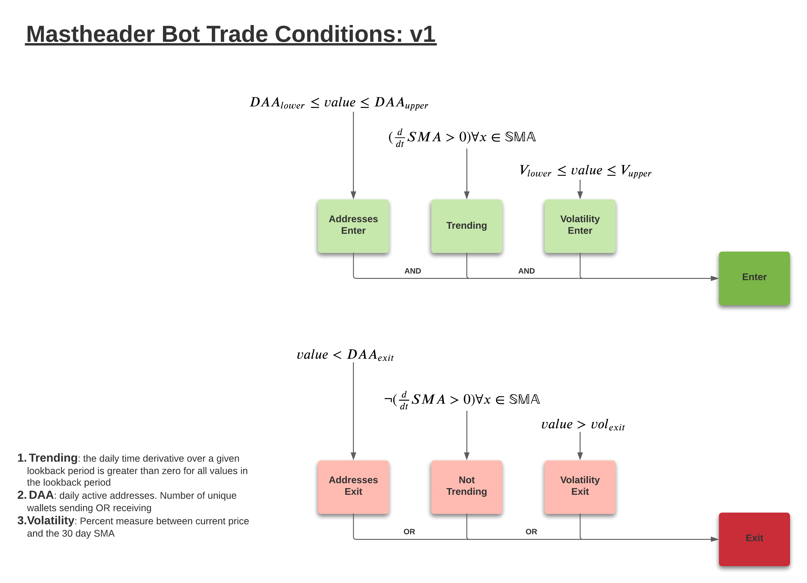

# Crypto Mastheader


Whaling ships commonly had three masts; the mizzen, main, and fore. 
Sailors would rotate in shifts to the top of each mast serving as lookouts for their
vocational prey; whales. Once the whale signs were spotted sailors would call out and the hunt
would begin. Each whale captured represented profit that would support the needs of the economy.


Like those whalers of old, the algorithm implemented in this GitHub repo looks for signs of activity in both
price action and on-chain analytics seeking generate profit.

---
# Requirements
1. Kucoin account with API key
2. Santiment account with API key
3. AWS account with sufficent permissions to deploy CloudFormation templates

## Deployment
Deployment is managed by the Serverless framework. Once the required environment variables
have been set, deployment is handled with a single command. 
```shell
# Easy deployment
serverless deploy
```

## Hyperparameters
The strategy hyperparameters were optimized using [Optuna](https://optuna.org/). The training set for optimization is 
represented by the historic data available from Santiment starting summer 2017 through August 2021. As new tickers were
introduced to the dataset, they are included for strategy parameter optimization. This approximates the expanding crypto
market and produces a more robust strategy algorithm.

The optimized parameters are:
1. Entry
   1. daily active addresses lower threshold
   2. daily active addresses upper threshold
   4. volatility lower threshold
   5. volatiitly upper threshold
2. Exit
   1. daily active addresses exit threshold
   2. volatility exit threshold 
3. General
   1. simple moving average lookback

---
# Service Overview


Multiple services support the end goal; profitable trades. Services are trigger in one of two ways; time or event.
The time trigger services include `discovery` and `harvest`. Event services include `strategy, trade, monitor`.

### Time Triggers


**Discovery** 

The `discovery` service provides simple yet vital information. "What new tokens, if any, are now supported by both the trading exchange and the analytics API?"
When triggered tickers are scraped from the exchange API and analytics API. The intersection of these sets represents
the available scope of execution.


**Harvest**

The `harvest` services consumes from the [Santiment](https://santiment.net/) API. Santiment is a cloud based service 
providing analytics on various blockchains. The scraped metrics are populated using a `datetime_last_updated`. 
Newly discovered tickers will default to 60 day lookback of metrics. Tickers already populated will look back to the 
previous time the harvest service executed.

If the Santiment API goes down for any reason, the will automatically backfill the data to the point where data was last
received, ensuring upto date metrics as available.

Once metrics have been populated for the tickers, they are pushed into an AWS SQS where the Strategy service will
determine trade viability.


### Event Triggers

**Strategy**


The `strategy` service loads an interval of data for each ticker. This time series is analyzed for multiple conditions
that in combination represent entry or independently represent an exit. All entry and exit signals are pushed to the 
AWS SQS queue for `buy` and `sell`.



_Metrics for Entry_  (AND)
1. Daily Active Addresses (DAA)
   1. The DAA values must value between predetermined upper and lower thresholds.
2. The rate of change of the daily SMA must be all positive for a given lookback
3. Volatility
   1. The volatility is measured as the price relative to the SMA. ((price - sma) / sma)

_Metrics for Exit_ (OR)
1. The Daily Active Addresses decreases below a threshold
2. The rate of change of the SMA has a negative value in the lookback set
3. The volatility exceedes the upper limits (blow off top)


**Trade**

The `trade` service executes trades pushed from `strategy`. SELL orders are process when received
as limit orders to the current asking price. BUY orders are determined based on the number of open trades and available
capital. A fixed amount of trades can exists at any time. Position size is determined by the available capital 
in the account. 

All BUYs are limit orders with an 1 hour expiration. Whatever amount of the order is unfilled after 1 hour, the order
is automatically cancelled.


**Monitor**

[Not yet implemented]


